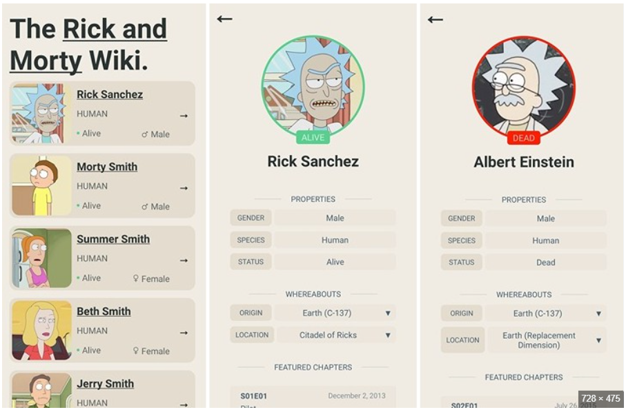
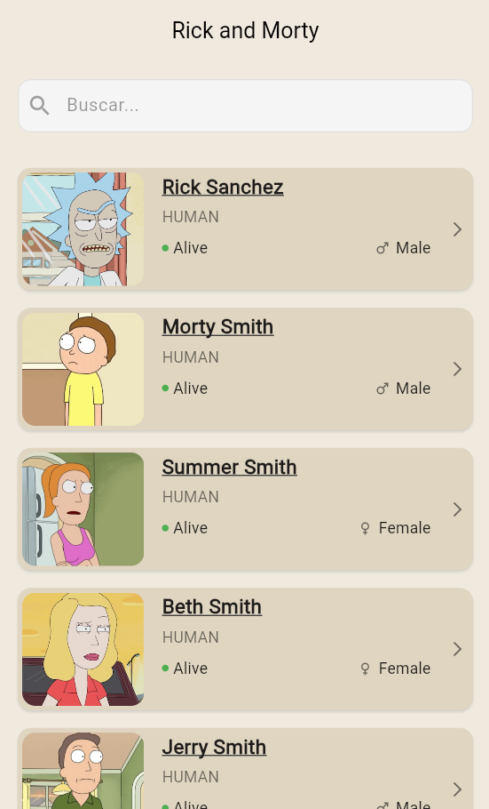
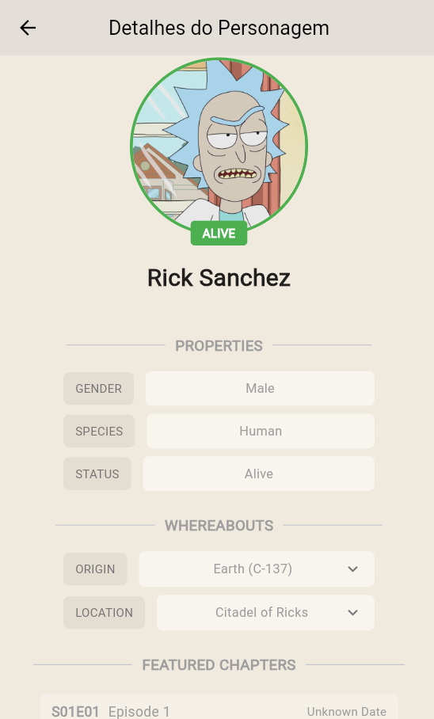
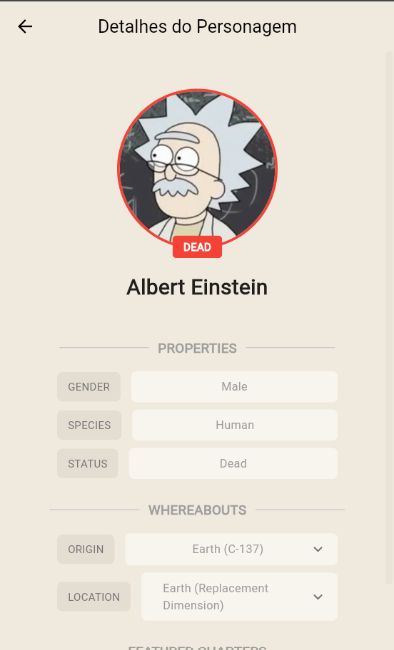

# Rick and Morty App

Uma aplicação mobile desenvolvida em Flutter que consome a API do Rick and Morty para exibir informações sobre os personagens da série.

## 🌐 Acesso Online

Você pode acessar a versão web da aplicação em: **[https://ricky-e-marty-app.web.app](https://ricky-e-marty-app.web.app)** , publicada através do Firebase Hosting.

## 📱 Sobre o App

Este aplicativo permite aos usuários explorar o universo de Rick and Morty através de uma interface intuitiva e responsiva. O app consome a [Rick and Morty API](https://rickandmortyapi.com/) para fornecer informações detalhadas sobre os personagens da série.

### 🎨 Inspiração do Layout

O design e layout da aplicação foram inspirados na imagem de referência abaixo. Esta imagem serviu como base para a criação da interface do usuário.



### 📱 Como Ficou o Resultado

A aplicação foi desenvolvida seguindo a inspiração acima e resultou nas seguintes telas:

| 🏠 Tela Inicial (Home) | 👤 Tela de Detalhes | 👤 Tela de Detalhes 2 |
|:---:|:---:|:---:|
|  |  |  |

## 🚀 Tecnologias Utilizadas

- **Flutter**: 3.29.2 (Stable Channel) 
- **Dart SDK**: ^3.6.0 
- **Gerenciamento de Estado**: Provider
- **Navegação**: Go Router
- **HTTP Client**: Dio
- **Cache de Imagens**: Cached Network Image
- **Loading States**: Shimmer 

## 📋 Requisitos Funcionais

- **Consumo da API Rick and Morty**
- **Exibir uma lista de personagens com seus respectivos nomes e imagens**
- **Exibir uma página de detalhes contendo: name, status, species**


### ✅ Funcionalidades Implementadas

1. **Consumo da API Rick and Morty**
   - Integração com a API REST da Rick and Morty
   - Busca e exibição de dados dos personagens
   - Paginação automática

2. **Listagem de Personagens**
   - Exibição de lista de personagens com nomes e imagens
   - Interface responsiva e otimizada para mobile

3. **Detalhes do Personagem**
   - Página de detalhes ao clicar em um personagem
   - Exibição de informações como:
     - **Nome** (name)
     - **Status** (status) com indicador visual
     - **Espécie** (species)


 

### Camadas da Arquitetura:

> **Nota:** Este projeto utiliza **Repository Pattern com MVC/MVP**, não Clean Architecture completa, por ser um aplicativo simples. Esta abordagem é adequada para projetos menores e oferece boa organização sem complexidade desnecessária.

- **Presentation Layer**: Pages, Controllers, Widgets
- **Data Layer**: Repositories, Services, Models


## 🛠️ Como Executar

### Pré-requisitos
- Flutter 3.29.2 ou superior 
- Dart SDK ^3.6.0

### Instalação
```bash
# Clone o repositório
git clone [URL_DO_REPOSITORIO]

# Navegue para o diretório do projeto
cd ricky_and_martie_app

# Instale as dependências
flutter pub get

# Execute o aplicativo
flutter run

### 🚀 Executando com Parâmetros

O aplicativo suporta configuração de ambientes através do arquivo `lib/config/environments.dart` e parâmetros de linha de comando.

#### Configuração de Ambientes

O arquivo `environments.dart` permite configurar diferentes URLs base para diferentes ambientes:

```dart
// Exemplo de configuração no arquivo environments.dart
static const String _devBaseUrl = 'https://dev-api.exemplo.com/api/';
static const String _prodBaseUrl = 'https://api.exemplo.com/api/';
static const String _defaultBaseUrl = 'https://rickandmortyapi.com/api/';
```

#### Parâmetro ENVIRONMENT
Permite selecionar o ambiente através de parâmetros de linha de comando:

```bash
# Usando ambiente padrão (Rick and Morty API)
flutter run

# Usando ambiente de desenvolvimento
flutter run --dart-define=ENVIRONMENT=development

# Usando ambiente de produção
flutter run --dart-define=ENVIRONMENT=production
```

**💡 Dica para Build:** Esta funcionalidade é especialmente útil durante o processo de build para diferentes ambientes (desenvolvimento e produção). Você pode configurar diferentes URLs base para cada ambiente sem precisar modificar o código.

### 🚀 Executando no VS Code

O arquivo `.vscode/launch.json` foi configurado com diferentes opções de debug para cada ambiente:

- **Default Environment** - Usa a API Rick and Morty
- **Development Environment** - Usa a URL de desenvolvimento
- **Production Environment** - Usa a URL de produção

Para cada plataforma (Android, iOS, Web Chrome, Web Edge, Current Device), você tem as 3 opções de ambiente disponíveis no menu de debug do VS Code.

 

 

## 📁 Estrutura do Projeto

```
lib/
├── main.dart                    # Ponto de entrada da aplicação
├── config/                      # Configurações do app
│   ├── app_widget.dart         # Widget principal
│   ├── assets.dart             # Configuração de assets
│   ├── strings.dart            # Strings da aplicação
│   └── themes/                 # Temas e cores
├── infrastructure/             # Camada de infraestrutura
│   ├── http/                   # Camada de comunicação com a API
│   ├── storage/                # Armazenamento local
│   └── routes.dart             # Configuração de rotas
├── models/                     # Modelos de dados
│   ├── character.dart          # Modelo de personagem
│   └── paginated_response.dart # Resposta paginada
├── pages/                      # Telas da aplicação
│   ├── home/                   # Página inicial
│   └── details/                # Página de detalhes
├── providers/                  # Gerenciamento de estado
│   └── dependency_injection.dart
├── repositories/               # Repositórios de dados
│   └── rickandmorty_repository.dart
└── widgets/                    # Widgets reutilizáveis
    ├── character_card.dart     # Card de personagem
    ├── character_image_widget.dart
    ├── status_indicator.dart   # Indicador de status
    ├── gender_indicator.dart   # Indicador de gênero
    ├── shimmer/                # Estados de loading
    └── error/                  # Widgets de erro
```

## 📦 Principais Dependências

- **dio**: ^5.8.0+1 - Cliente HTTP
- **cached_network_image**: ^3.4.1 - Cache de imagens
- **shimmer**: ^3.0.0 - Efeitos de loading
- **go_router**: ^16.1.0 - Navegação
- **provider**: ^6.1.5 - Gerenciamento de estado
- **dartz**: ^0.10.1 - Programação funcional 
- **flutter_launcher_icons**: ^0.14.1 - Ícones do aplicativo

## 🧪 Testes

Implementou-se testes neste projeto, com o objetivo de demonstrar o conhecimento em diferentes tipos de testes no Flutter. Para mais detalhes sobre os testes implementados, consulte o arquivo **[TESTES_IMPLEMENTADOS.md](TESTES_IMPLEMENTADOS.md)**.

### 📊 Cobertura de Testes

- **Testes de Modelo**: 5 testes - Validação de JSON, status de personagens, cores de status
- **Testes de Widget**: 5 testes - Renderização, indicadores, navegação, imagens
- **Testes de Controller**: 12 testes - Carregamento de dados, paginação, estados de UI
- **Testes de Repositório**: 14 testes - Chamadas da API, parsing de JSON, tratamento de erros

### 🚀 Executando os Testes

```bash
# Executar todos os testes
flutter test

# Executar testes específicos
flutter test test/models/
flutter test test/widgets/
flutter test test/controllers/
flutter test test/repositories/

# Executar com cobertura
flutter test --coverage
```

## 🔗 API Utilizada

- **Rick and Morty API**: https://rickandmortyapi.com/
- Documentação: https://rickandmortyapi.com/documentation

  
